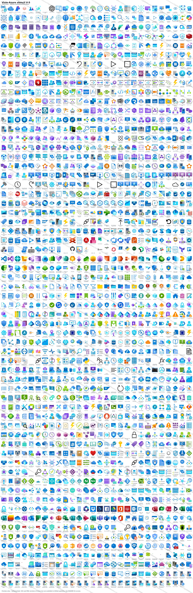

<div align="center">

# 🔷 V I S I O - A Z U R E

### A modern, searchable Visio stencil set for Microsoft Azure

**1,773 masters. Working shape search. Connection points. Shape data. Metric *and* US-unit builds. Drop-in ready.**

<br/>

<a href="LICENSE"></a>
<a href="https://xeeva.github.io/Visio-Azure"></a>
<a href="https://github.com/sponsors/xeeva"></a>

<br/>

<table>
<tr>
<td>

```
██╗   ██╗██╗███████╗██╗ ██████╗       █████╗ ███████╗██╗   ██╗██████╗ ███████╗
██║   ██║██║██╔════╝██║██╔═══██╗     ██╔══██╗╚══███╔╝██║   ██║██╔══██╗██╔════╝
██║   ██║██║███████╗██║██║   ██║     ███████║  ███╔╝ ██║   ██║██████╔╝█████╗
╚██╗ ██╔╝██║╚════██║██║██║   ██║     ██╔══██║ ███╔╝  ██║   ██║██╔══██╗██╔══╝
 ╚████╔╝ ██║███████║██║╚██████╔╝     ██║  ██║███████╗╚██████╔╝██║  ██║███████╗
  ╚═══╝  ╚═╝╚══════╝╚═╝ ╚═════╝      ╚═╝  ╚═╝╚══════╝ ╚═════╝ ╚═╝  ╚═╝╚══════╝
```

</td>
</tr>
</table>

---

**Drop. Connect. Document. Done.**

</div>

<br/>

## The Problem

Microsoft maintains a beautiful set of Azure service icons, but they ship as flat SVGs. Dropping them onto a Visio canvas works, but you lose every Visio feature that makes diagramming productive:

- **No connection points** -- lines snap to the icon edge or centre instead of a fixed N/E/S/W/corner anchor.
- **No properly positioned text field** -- captions land in the middle of the icon and have to be repositioned by hand on every drop.
- **Import size depends on the source viewBox** -- one icon comes in at 9 mm, the next at 32 mm, and you spend more time resizing than designing.
- **No shape data** -- you can't programmatically tag a master with the ResourceId / Location / SubscriptionId metadata Azure resources actually carry.
- **Shape search doesn't work** -- keywords have to land in *all four* of the cells Visio indexes, or typing "vmss" in the Shapes panel finds nothing.
- **One unit system only** -- a stencil authored in millimetres drops at the wrong real-world size onto a US-units (inches) drawing, and vice-versa.

These limitations are the difference between *Azure icons in Visio* and *an Azure stencil for Visio*.

## The Solution

**Visio-Azure** is a fully-equipped Visio stencil set covering **1,773 masters** across 17 groups -- Azure services, configuration items, and on-prem / IaaS workloads -- shipped in both **Metric** and **US-unit** builds. Every master in every stencil ships with:

- ✅ **Nine named connection points** -- North, East, South, West, four corners, plus SouthOfText for caption anchoring
- ✅ **Pre-positioned caption field** -- the text below the icon, not over it, capped to wrap on long names
- ✅ **20 mm normalised size** -- every icon's longer side scales to 20 mm (or the imperial equivalent) so a drawing of 50 different services looks like one drawing, not a collage
- ✅ **Seven Shape Data fields** -- ResourceId, Location, ResourceName, ResourceGroupName, ResourceType, TagsTable, SubscriptionId, populated for every non-Office365 master
- ✅ **Working shape search** -- keywords written into *all four* of the cells Visio indexes, so typing `vmss` or `key vault` actually finds something
- ✅ **27 dark-mode (`-DM`) variants** -- monochrome-black logos (OpenAI, GitHub, Kafka, action glyphs, …) ship a white-fill twin so they stay visible on a dark canvas
- ✅ **A drawing-resources companion stencil** -- DashBox, Line, PathLine, AngleLine, ArcLine, Callout, Bubble, GlowLine, GlowBox (9 colours), single/dashed/thick connector arrows, and colour palettes for annotation

**[Read the full documentation →](https://xeeva.github.io/Visio-Azure)**

<br/>

## Built differently -- and it shows

This set isn't drawn by hand and it isn't a one-off export. The entire collection is **generated programmatically** from the source artwork by a purpose-built pipeline: scan → normalise → scale → assemble OOXML → verify, with every connection point, shape-data field, caption rule, search keyword, and unit variant applied automatically to all 1,773 masters and machine-verified against a per-master contract before it ships.

The earlier approach was a **PowerShell + Visio-COM** script: Windows-only, painfully slow, and it needed a live Visio instance to drive the COM API one shape at a time -- with broken icons fixed by hand, one SVG at a time. The new pipeline obliterates that:

| | Old PowerShell + COM | New generation pipeline |
| --- | --- | --- |
| Platform | Windows + Visio required | Cross-platform, no Visio install |
| How | Visio COM, shape by shape | OOXML emitted directly |
| Fixes | Hand-edited per icon | Detected and corrected automatically |
| Output | Single unit system | Metric **and** US, byte-for-byte deterministic |
| Speed | Hours, babysat | The whole set in seconds, unattended |

Gradient drift, padded viewBoxes, broken search cells, invisible-on-dark logos -- all handled in the build, not in a weekend of manual SVG surgery. The result is a stencil set that's consistent, reproducible, and trivial to regenerate the moment Microsoft refreshes the icons.

<br/>

## Preview

<div align="center">



*Watermarked preview. Per-icon SVG and PNG files, and styled variants, are part of **[Premium](#premium)**.*

</div>

<br/>

## ⚠️ Pick your units first: Metric or US

This is the one decision to get right before you download. We ship **two identical icon sets** that differ only in their internal Visio measurement units.

| Your Visio drawing uses… | Download | Folder |
| --- | --- | --- |
| **Centimetres / millimetres** (most of the world, AU/EU/UK metric templates) | **[Metric stencils (.zip)](Visio-Azure-Stencils-Metric-V5.zip)** | [`Stencil-Metric/`](Stencil-Metric) |
| **Inches / feet** (US templates, US/Imperial regional setting) | **[US stencils (.zip)](Visio-Azure-Stencils-US-V5.zip)** | [`Stencil-US/`](Stencil-US) |

**Why two stencils?** A Visio master carries its size in a fixed unit system. Drop a millimetre-authored icon onto an inches drawing and Visio re-interprets the number, so a 20 mm icon can land at the wrong physical size and your shape-data measurements read awkwardly. Matching the stencil's units to your drawing means icons drop at the correct real-world size, snap cleanly to the grid, and report sensible dimensions. **The artwork, connection points, shape data, and search keywords are identical in both** -- only the unit system changes.

> Not sure which you use? In Visio: **Design → Page Setup → Measurement units**. If it says cm/mm, take Metric; if inches/feet, take US.

<br/>

## Quick Start

### 1. Download the set for your units

Grab the zip from the table above, or pick individual stencils:

| Option | Metric | US |
| --- | --- | --- |
| **All icons** (easiest start) | [`Stencil-Metric/Azure_All-Icons_V-5_m.vssx`](Stencil-Metric/Azure_All-Icons_V-5_m.vssx) | [`Stencil-US/Azure_All-Icons_V-5_u.vssx`](Stencil-US/Azure_All-Icons_V-5_u.vssx) |
| **Drawing resources** (lines, arrows, callouts, glows) | [`Stencil-Metric/Azure_Drawing-Resources_V-5.vssx`](Stencil-Metric/Azure_Drawing-Resources_V-5.vssx) | [`Stencil-US/Azure_Drawing-Resources_V-5.vssx`](Stencil-US/Azure_Drawing-Resources_V-5.vssx) |
| **By group** (AI, Networking, Storage, …) | [`Stencil-Metric/`](Stencil-Metric) | [`Stencil-US/`](Stencil-US) |

### 2. Open in Visio

Double-click any `.vssx`. The stencil opens in Visio's **Shapes** panel on the left.

### 3. Drop and Connect

Drag an icon onto the canvas. Hover near an edge to see the connection points; draw a connector from one icon's anchor straight to another's.

### 4. Search

Type a service name into the search box at the top of the Shapes panel ("key vault", "vmss", "load balancer"). Keywords are written into every cell Visio indexes, so it just works.

### 5. Dark canvas? Use the `-DM` icons

Working on a dark theme or dark-filled background? The 27 black logos each have a `-DM` twin (e.g. search `OpenAI -DM`, `GitHub -DM`) drawn in white so they stay legible.

**[Full setup guide, including how to enable Visio shape search →](https://xeeva.github.io/Visio-Azure/getting-started)**

<br/>

## Icon Features

<table>
<tr>
<td align="center" width="20%">

### 🔗 Connection Points
Nine named anchors per icon for predictable line attach.

**N / E / S / W / corners**

</td>
<td align="center" width="20%">

### 📐 Normalised Size
20 mm on the longer side. Aspect preserved.

**Every icon the same scale**

</td>
<td align="center" width="20%">

### 🏷️ Shape Data
Seven fields ready for resource metadata.

**ResourceId, Location, …**

</td>
<td align="center" width="20%">

### 🔍 Search Works
Keywords in all four cells Visio actually indexes.

**Type "vmss" -- find Scale Set**

</td>
<td align="center" width="20%">

### 🌓 Dark Mode
White `-DM` twins for black logos.

**Visible on any canvas**

</td>
</tr>
</table>

**[How each of these works, in depth →](https://xeeva.github.io/Visio-Azure/icon-features)**

<br/>

## Premium

The `.vssx` stencils here are **free and GPL-licensed** -- all 1,773 masters, both unit systems, no strings. **Premium** *(in build)* adds the things that take real ongoing effort to produce and maintain:

- 🎨 **Styled variants** -- alternate visual treatments of the full set (e.g. glass / 3D / mono) for design-led diagrams
- 🖼️ **Per-icon PNG renders** -- 256 px and 1024 px, drop-ready for slides, docs, and the web
- 📐 **Per-icon SVG files** -- normalised, cleaned, and ready to drop into any tool
- 🚀 Early access to new releases and styled sets

**[Register interest / sponsor →](https://github.com/sponsors/xeeva)**

### Why the raw assets and styles sit behind Premium

Earlier releases of an Azure stencil collection distributed the per-icon SVG and PNG files freely. They were promptly **re-hosted and resold by third parties with the licence and attribution stripped** -- exactly the infringement an open licence is supposed to prevent, and exactly what kills an unfunded project.

The position now is deliberate: the **functional stencils stay free and open** (that's the part the community actually needs), while the **raw, easily-repackaged asset files and the styled variants are Premium**. It's the difference between *giving the work away* and *having it taken*, and it's what keeps the set maintained and regenerated as Microsoft's icons evolve.

<br/>

## Versioning

| Version | Released | Masters | Notable |
| --- | --- | --- | --- |
| **V-5** | 2026-06 | 1,773 | Metric + US-unit builds. 27 dark-mode `-DM` variants. Programmatic, deterministic generation pipeline. Working shape search. Drawing-resources companion. |

The current release is also published as a [GitHub Release](https://github.com/xeeva/Visio-Azure/releases) with per-unit zip downloads.

> **Two things that make or break your experience with any release:**
>
> 1. **Match the unit of measure.** Download the build (Metric `_m` or US `_u`) that matches your Visio drawing's units. A mismatch makes icons drop at the wrong physical size and report odd dimensions — the artwork is identical, only the unit system differs. [Which one?](https://xeeva.github.io/Visio-Azure/units)
> 2. **Shape search must be on.** Every master carries searchable keywords (group + full name), but Visio's *Search for Shapes* box has to be enabled first, and the stencil added to **My Shapes** or open in the panel. If a search returns nothing, see [Enabling search](https://xeeva.github.io/Visio-Azure/enabling-search).

**[Full release notes →](https://xeeva.github.io/Visio-Azure/releases)**

<br/>

## Licence

The source icons are Microsoft Azure service icons, distributed under the terms Microsoft publishes alongside them.

This work is licensed under **GPL-3.0** -- you may redistribute, modify, and use the stencils freely, including in commercial work, provided you preserve the licence and attribution.

<br/>

## Get Involved

- **Request an icon:** [open an Icon Request](https://github.com/xeeva/Visio-Azure/issues/new?template=icon_request.yml) -- missing a service? Ask for it.
- **Report a problem:** [open a Bug Report](https://github.com/xeeva/Visio-Azure/issues/new?template=bug_report.yml) -- a wrong-looking icon, rendering glitch, or search miss.
- **Discussions:** [github.com/xeeva/Visio-Azure/discussions](https://github.com/xeeva/Visio-Azure/discussions) -- ask questions, show off diagrams, propose ideas.
- **Premium / sponsor:** [github.com/sponsors/xeeva](https://github.com/sponsors/xeeva) -- styled variants plus the SVG/PNG asset library.

<div align="center">

<br/>

*Made for designers, architects, and anyone who still believes a good diagram beats a thousand words.*

</div>
