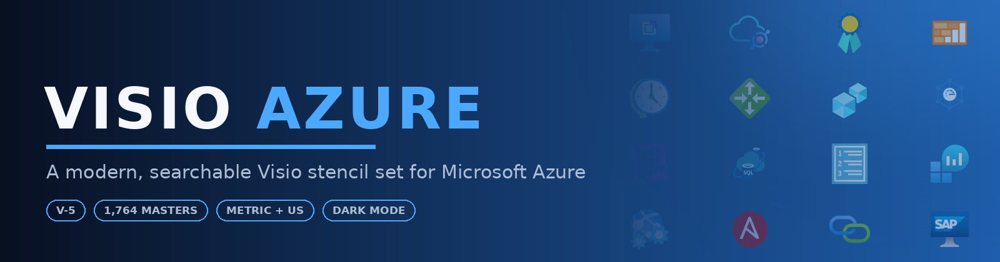
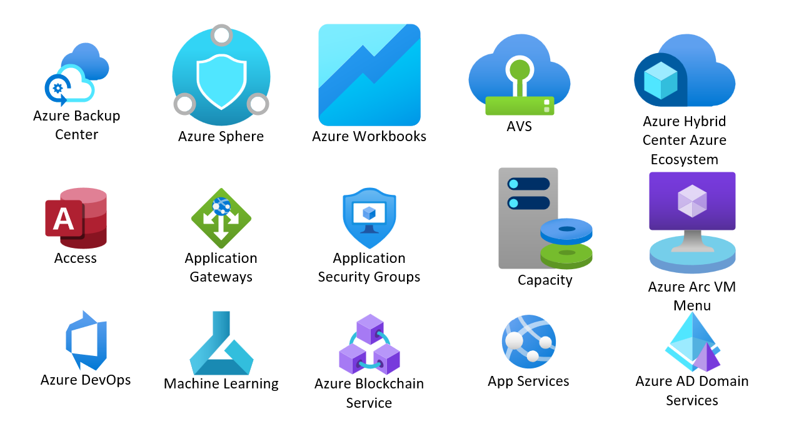

# Azure Visio Stencil Pack

**The free Azure Visio stencil pack: 1,764 Microsoft Azure icons for Visio.** Working shape search, connection points, shape data, Metric *and* US-unit builds. A drop-in alternative to Microsoft's SVG-only icon downloads.

 

---

**Drop. Connect. Document. Done.**

 

## The Problem

The Azure stencils you can find are a patchwork: hundreds of products spread across many separate stencils from different providers, often mixing raster PNG icons with vectors, dropped at inconsistent sizes, and many already out of date. Even setting that aside, none of them carry the Visio features that make diagramming productive:

- **No connection points:** lines snap to the icon edge or centre instead of a fixed N/E/S/W/corner anchor.
- **No properly positioned text field:** captions land in the middle of the icon and have to be repositioned by hand on every drop.
- **Import size depends on the source viewBox:** one icon comes in at 9 mm, the next at 32 mm, and you spend more time resizing than designing.
- **No shape data:** you can't programmatically tag a master with the ResourceId / Location / SubscriptionId metadata Azure resources actually carry.
- **Shape search doesn't work:** keywords have to land in *all four* of the cells Visio indexes, or typing "vmss" in the Shapes panel finds nothing.
- **One unit system only:** a stencil authored in millimetres drops at the wrong real-world size onto a US-units (inches) drawing, and vice-versa.

These limitations are the difference between *Azure icons in Visio* and *an Azure stencil for Visio*.

*Pull icons from the various official stencils onto one page and they land at wildly different sizes, a collage instead of a diagram. This is the inconsistency Visio-Azure fixes.*

## The Solution

Microsoft now publishes its Azure icons only as SVG and PNG downloads, not as Visio stencils. **Visio-Azure** is the drop-in alternative: it unifies and standardises the lot into one fully-equipped **Azure Visio stencil** pack of **1,764 masters** across 17 groups, Azure services, configuration items, and on-prem / IaaS workloads, shipped in both **Metric** and **US-unit** builds. Every master in every stencil ships with:

- ✅ **Nine named connection points:** North, East, South, West, four corners, plus SouthOfText for caption anchoring
- ✅ **Pre-positioned caption field:** the text below the icon, not over it, capped to wrap on long names
- ✅ **20 mm normalised size:** every icon's longer side scales to 20 mm (or the imperial equivalent) so a drawing of 50 different services looks like one drawing, not a collage
- ✅ **Seven Shape Data fields:** ResourceId, Location, ResourceName, ResourceGroupName, ResourceType, TagsTable, SubscriptionId, populated for every non-Office365 master
- ✅ **Working shape search:** keywords written into *all four* of the cells Visio indexes, so typing `vmss` or `key vault` actually finds something
- ✅ **27 dark-mode (`-DM`) variants:** monochrome-black logos (OpenAI, GitHub, Kafka, action glyphs, …) ship a white-fill twin so they stay visible on a dark canvas
- ✅ **A drawing-resources companion stencil:** DashBox, Line, PathLine, AngleLine, ArcLine, Callout, Bubble, GlowLine, GlowBox (9 colours), single/dashed/thick connector arrows, and colour palettes for annotation

**[Read the full documentation →](https://xeeva.github.io/Visio-Azure)**

 

## Built differently, and it shows

This set isn't drawn by hand and it isn't a one-off export. The entire collection is **generated programmatically** from the source artwork by a purpose-built pipeline: scan → normalise → scale → assemble OOXML → verify, with every connection point, shape-data field, caption rule, search keyword, and unit variant applied automatically to all 1,764 masters and machine-verified against a per-master contract before it ships.

The earlier approach was a **PowerShell + Visio-COM** script: Windows-only, painfully slow, and it needed a live Visio instance to drive the COM API one shape at a time, with broken icons fixed by hand, one SVG at a time. The new pipeline obliterates that:

| | Old PowerShell + COM | New generation pipeline |
| --- | --- | --- |
| Platform | Windows + Visio required | Cross-platform, no Visio install |
| How | Visio COM, shape by shape | OOXML emitted directly |
| Fixes | Hand-edited per icon | Detected and corrected automatically |
| Output | Single unit system | Metric **and** US, byte-for-byte deterministic |
| Speed | Hours, babysat | The whole set in seconds, unattended |

Gradient drift, padded viewBoxes, broken search cells, invisible-on-dark logos: all handled in the build, not in a weekend of manual SVG surgery. The result is a stencil set that's consistent, reproducible, and trivial to regenerate the moment Microsoft refreshes the icons.

 

## Preview

*Watermarked preview of the full set. Per-icon SVG and PNG files are part of the coming-soon **[Premium](#sponsor)** set.*

 

## ⚠️ Pick your units first: Metric or US

This is the one decision to get right before you download. We ship **two identical icon sets** that differ only in their internal Visio measurement units.

| Your Visio drawing uses… | Download | Folder |
| --- | --- | --- |
| **Centimetres / millimetres** (most of the world, AU/EU/UK metric templates) | **[Metric stencils (.zip)](Visio-Azure-Stencils-Metric-V5.zip)** | [`Stencil-Metric/`](Stencil-Metric) |
| **Inches / feet** (US templates, US/Imperial regional setting) | **[US stencils (.zip)](Visio-Azure-Stencils-US-V5.zip)** | [`Stencil-US/`](Stencil-US) |

**Why two stencils?** A Visio master carries its size in a fixed unit system. Drop a millimetre-authored icon onto an inches drawing and Visio re-interprets the number, so a 20 mm icon can land at the wrong physical size and your shape-data measurements read awkwardly. Matching the stencil's units to your drawing means icons drop at the correct real-world size, snap cleanly to the grid, and report sensible dimensions. **The artwork, connection points, shape data, and search keywords are identical in both;** only the unit system changes.

> Not sure which you use? In Visio: **Design → Page Setup → Measurement units**. If it says cm/mm, take Metric; if inches/feet, take US.

 

## Quick Start

### 1. Download the set for your units

Grab the zip from the table above, or pick individual stencils:

| Option | Metric | US |
| --- | --- | --- |
| **All icons** (easiest start) | [`Azure_All-Icons_V-5_m.vssx`](Stencil-Metric/Azure_All-Icons_V-5_m.vssx) | [`Azure_All-Icons_V-5_u.vssx`](Stencil-US/Azure_All-Icons_V-5_u.vssx) |
| **Drawing resources** (lines, arrows, callouts, glows) | [`Azure_Drawing-Resources_V-5.vssx`](Stencil-Metric/Azure_Drawing-Resources_V-5.vssx) | [`Azure_Drawing-Resources_V-5.vssx`](Stencil-US/Azure_Drawing-Resources_V-5.vssx) |
| **By group** (AI, Networking, Storage, …) | [`Stencil-Metric/`](Stencil-Metric) | [`Stencil-US/`](Stencil-US) |

**Individual group stencils:**

| Group | Masters | Metric | US |
| --- | --- | --- | --- |
| AI | 101 | [`Azure_AI_V-5_m.vssx`](Stencil-Metric/Azure_AI_V-5_m.vssx) | [`Azure_AI_V-5_u.vssx`](Stencil-US/Azure_AI_V-5_u.vssx) |
| Application | 214 | [`Azure_Application_V-5_m.vssx`](Stencil-Metric/Azure_Application_V-5_m.vssx) | [`Azure_Application_V-5_u.vssx`](Stencil-US/Azure_Application_V-5_u.vssx) |
| Compute | 246 | [`Azure_Compute_V-5_m.vssx`](Stencil-Metric/Azure_Compute_V-5_m.vssx) | [`Azure_Compute_V-5_u.vssx`](Stencil-US/Azure_Compute_V-5_u.vssx) |
| Data | 146 | [`Azure_Data_V-5_m.vssx`](Stencil-Metric/Azure_Data_V-5_m.vssx) | [`Azure_Data_V-5_u.vssx`](Stencil-US/Azure_Data_V-5_u.vssx) |
| Deployment | 51 | [`Azure_Deployment_V-5_m.vssx`](Stencil-Metric/Azure_Deployment_V-5_m.vssx) | [`Azure_Deployment_V-5_u.vssx`](Stencil-US/Azure_Deployment_V-5_u.vssx) |
| Dynamics 365 | 35 | [`Azure_Dynamics 365_V-5_m.vssx`](Stencil-Metric/Azure_Dynamics%20365_V-5_m.vssx) | [`Azure_Dynamics 365_V-5_u.vssx`](Stencil-US/Azure_Dynamics%20365_V-5_u.vssx) |
| Endpoint | 37 | [`Azure_Endpoint_V-5_m.vssx`](Stencil-Metric/Azure_Endpoint_V-5_m.vssx) | [`Azure_Endpoint_V-5_u.vssx`](Stencil-US/Azure_Endpoint_V-5_u.vssx) |
| Generic | 77 | [`Azure_Generic_V-5_m.vssx`](Stencil-Metric/Azure_Generic_V-5_m.vssx) | [`Azure_Generic_V-5_u.vssx`](Stencil-US/Azure_Generic_V-5_u.vssx) |
| Identity | 76 | [`Azure_Identity_V-5_m.vssx`](Stencil-Metric/Azure_Identity_V-5_m.vssx) | [`Azure_Identity_V-5_u.vssx`](Stencil-US/Azure_Identity_V-5_u.vssx) |
| IoT | 45 | [`Azure_IoT_V-5_m.vssx`](Stencil-Metric/Azure_IoT_V-5_m.vssx) | [`Azure_IoT_V-5_u.vssx`](Stencil-US/Azure_IoT_V-5_u.vssx) |
| Management | 329 | [`Azure_Management_V-5_m.vssx`](Stencil-Metric/Azure_Management_V-5_m.vssx) | [`Azure_Management_V-5_u.vssx`](Stencil-US/Azure_Management_V-5_u.vssx) |
| Networking | 164 | [`Azure_Networking_V-5_m.vssx`](Stencil-Metric/Azure_Networking_V-5_m.vssx) | [`Azure_Networking_V-5_u.vssx`](Stencil-US/Azure_Networking_V-5_u.vssx) |
| Office365 | 38 | [`Azure_Office365_V-5_m.vssx`](Stencil-Metric/Azure_Office365_V-5_m.vssx) | [`Azure_Office365_V-5_u.vssx`](Stencil-US/Azure_Office365_V-5_u.vssx) |
| Security | 95 | [`Azure_Security_V-5_m.vssx`](Stencil-Metric/Azure_Security_V-5_m.vssx) | [`Azure_Security_V-5_u.vssx`](Stencil-US/Azure_Security_V-5_u.vssx) |
| Storage | 57 | [`Azure_Storage_V-5_m.vssx`](Stencil-Metric/Azure_Storage_V-5_m.vssx) | [`Azure_Storage_V-5_u.vssx`](Stencil-US/Azure_Storage_V-5_u.vssx) |
| Workload | 31 | [`Azure_Workload_V-5_m.vssx`](Stencil-Metric/Azure_Workload_V-5_m.vssx) | [`Azure_Workload_V-5_u.vssx`](Stencil-US/Azure_Workload_V-5_u.vssx) |
| Workload-Service | 22 | [`Azure_Workload-Service_V-5_m.vssx`](Stencil-Metric/Azure_Workload-Service_V-5_m.vssx) | [`Azure_Workload-Service_V-5_u.vssx`](Stencil-US/Azure_Workload-Service_V-5_u.vssx) |

### 2. Open in Visio

Double-click any `.vssx`. The stencil opens in Visio's **Shapes** panel on the left.

### 3. Drop and Connect

Drag an icon onto the canvas. Hover near an edge to see the connection points; draw a connector from one icon's anchor straight to another's.

### 4. Search

Type a service name into the search box at the top of the Shapes panel ("key vault", "vmss", "load balancer"). Keywords are written into every cell Visio indexes, so it just works.

### 5. Dark canvas? Use the `-DM` icons

Working on a dark theme or dark-filled background? The 27 black logos each have a `-DM` twin (e.g. search `OpenAI -DM`, `GitHub -DM`) drawn in white so they stay legible.

**[Full setup guide, including how to enable Visio shape search →](https://xeeva.github.io/Visio-Azure/getting-started)**

 

## Icon Features

<table>
<tr>
<td align="center" width="20%">

### 🔗 Connection Points
Nine named anchors per icon for predictable line attach.

**N / E / S / W / corners**

</td>
<td align="center" width="20%">

### 📐 Normalised Size
20 mm on the longer side. Aspect preserved.

**Every icon the same scale**

</td>
<td align="center" width="20%">

### 🏷️ Shape Data
Seven fields ready for resource metadata.

**ResourceId, Location, …**

</td>
<td align="center" width="20%">

### 🔍 Search Works
Keywords in all four cells Visio actually indexes.

**Type "vmss", find Scale Set**

</td>
<td align="center" width="20%">

### 🌓 Dark Mode
White `-DM` twins for black logos.

**Visible on any canvas**

</td>
</tr>
</table>

*The per-master contract, live in Visio's ShapeSheet: nine named connection points and the seven shape-data rows.*

 

*Shape Data on a dropped master: ResourceId, Location, ResourceName, ResourceGroupName, ResourceType, TagsTable, SubscriptionId, ready to fill by hand or by script.*

**[How each of these works, in depth →](https://xeeva.github.io/Visio-Azure/icon-features)**

 

## Sponsor

The `.vssx` stencils are **free and open** under GPL-3.0: all 1,764 masters, both unit systems, no strings. There is nothing to buy to use the icons in Visio.

If they save you time and you appreciate the work, sponsoring helps keep the set maintained and regenerated as Microsoft refreshes its Azure icons. Any amount, one-off or monthly, is genuinely appreciated.

**[Sponsor on GitHub →](https://github.com/sponsors/xeeva)**

A separate **Premium** set is *coming soon*: per-icon SVG and PNG renders. The details are still being worked out, so there is nothing to sign up for yet; sponsoring is the best way to register interest.

 

## Versioning

| Version | Released | Masters | Notable |
| --- | --- | --- | --- |
| **V-5** | 2026-06 | 1,764 | Metric + US-unit builds. 27 dark-mode `-DM` variants. Programmatic, deterministic generation pipeline. Working shape search. Drawing-resources companion. |

The current release is also published as a [GitHub Release](https://github.com/xeeva/Visio-Azure/releases) with per-unit zip downloads.

> **Two things that make or break your experience with any release:**
>
> 1. **Match the unit of measure.** Download the build (Metric `_m` or US `_u`) that matches your Visio drawing's units. A mismatch makes icons drop at the wrong physical size and report odd dimensions; the artwork is identical, only the unit system differs. [Which one?](https://xeeva.github.io/Visio-Azure/units)
> 2. **Shape search must be on.** Every master carries searchable keywords, but Visio's *Search for Shapes* box has to be enabled first, and the stencil added to **My Shapes** or open in the panel. If a search returns nothing, see [Enabling search](https://xeeva.github.io/Visio-Azure/enabling-search).

**[Full release notes →](https://xeeva.github.io/Visio-Azure/releases)**

 

## Licence

Two layers of rights apply to this collection, and they are different things:

- **The icon artwork** is copyright Microsoft Corporation. Microsoft publishes its Azure architecture icons for free use in architecture diagrams under the terms on the [Azure architecture icons page](https://learn.microsoft.com/en-us/azure/architecture/icons/): you may use the icons in diagrams, but you may not alter them, and you must not use them to imply Microsoft endorsement. Use the icons for Azure diagrams as Microsoft intends; do not modify the artwork.
- **The stencil engineering** (the Visio packaging, connection points, shape data, caption and search treatment, and these documents) is licensed under **GPL-3.0**: you may redistribute, modify, and use it freely, including in commercial work, provided you preserve the licence and attribution. The build pipeline that generates the set is private; its outputs are what is published here.

This is a community project. It is not affiliated with, sponsored by, or endorsed by Microsoft Corporation. Azure and the Microsoft product names used in master names are trademarks of Microsoft Corporation.

 

## Get Involved

- **Request an icon:** [open an Icon Request](https://github.com/xeeva/Visio-Azure/issues/new?template=icon_request.yml): missing a service? Ask for it.
- **Report a problem:** [open a Bug Report](https://github.com/xeeva/Visio-Azure/issues/new?template=bug_report.yml): a wrong-looking icon, rendering glitch, or search miss.
- **Discussions:** [github.com/xeeva/Visio-Azure/discussions](https://github.com/xeeva/Visio-Azure/discussions): ask questions, show off diagrams, propose ideas.
- **Sponsor:** [github.com/sponsors/xeeva](https://github.com/sponsors/xeeva): support ongoing maintenance, and register interest in the coming-soon Premium set.

 

*Made for designers, architects, and anyone who still believes a good diagram beats a thousand words.*

