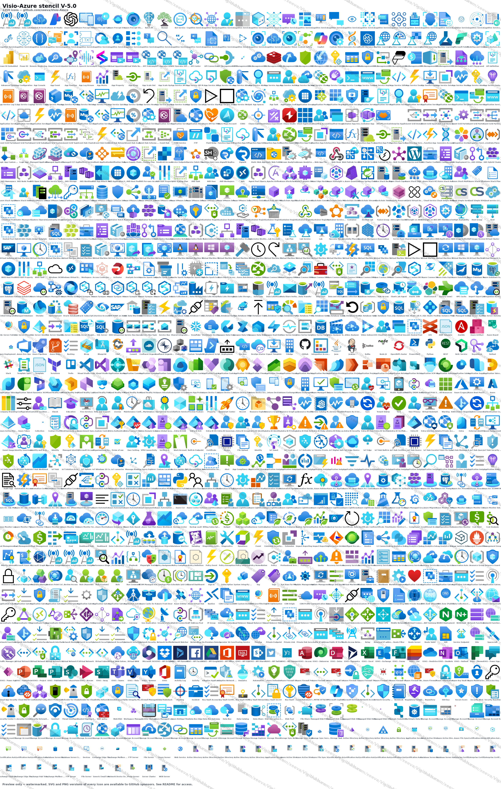

<div align="center">

# 🔷 V I S I O - A Z U R E

### A modern, searchable Visio stencil set for Microsoft Azure

**1,259 Azure icons. Working shape search. Connection points. Shape data. Drop-in ready.**

<br/>

[](https://github.com/xeeva/Visio-Azure)
[](LICENSE)
[](https://xeeva.github.io/Visio-Azure)
[](https://www.microsoft.com/en-au/microsoft-365/visio)
[](https://github.com/sponsors/xeeva)

<br/>

<table>
<tr>
<td>

```
██╗   ██╗██╗███████╗██╗ ██████╗       █████╗ ███████╗██╗   ██╗██████╗ ███████╗
██║   ██║██║██╔════╝██║██╔═══██╗     ██╔══██╗╚══███╔╝██║   ██║██╔══██╗██╔════╝
██║   ██║██║███████╗██║██║   ██║     ███████║  ███╔╝ ██║   ██║██████╔╝█████╗
╚██╗ ██╔╝██║╚════██║██║██║   ██║     ██╔══██║ ███╔╝  ██║   ██║██╔══██╗██╔══╝
 ╚████╔╝ ██║███████║██║╚██████╔╝     ██║  ██║███████╗╚██████╔╝██║  ██║███████╗
  ╚═══╝  ╚═╝╚══════╝╚═╝ ╚═════╝      ╚═╝  ╚═╝╚══════╝ ╚═════╝ ╚═╝  ╚═╝╚══════╝
```

</td>
</tr>
</table>

---

**Drop. Connect. Document. Done.**

</div>

<br/>

## The Problem

Microsoft maintains a beautiful set of Azure service icons, but they ship as flat SVGs. Dropping them onto a Visio canvas works, but you lose every Visio feature that makes diagramming productive:

- **No connection points** -- lines snap to the icon edge or centre instead of a fixed N/E/S/W/corner anchor.
- **No properly positioned text field** -- captions land in the middle of the icon and have to be repositioned by hand on every drop.
- **Import size depends on the source viewBox** -- one icon comes in at 9 mm, the next at 32 mm, and you spend more time resizing than designing.
- **No shape data** -- you can't programmatically tag a master with the ResourceId / Location / SubscriptionId metadata Azure resources actually carry.
- **Shape search is broken** -- the original stencil sets had keywords in only one of the four cells Visio actually indexes, so typing "vmss" in the Shapes panel found nothing.

These limitations were the difference between *Azure icons in Visio* and *an Azure stencil for Visio*.

## The Solution

**Visio-Azure** is a fully-equipped, programmatically-built Visio stencil set covering 1,259 Azure services and configuration items. Every master in every stencil ships with:

- ✅ **Nine named connection points** -- North, East, South, West, four corners, plus SouthOfText for caption anchoring
- ✅ **Pre-positioned caption field** -- the text below the icon, not over it, capped to wrap on long names
- ✅ **20 mm normalised size** -- every icon's longer side scales to 20 mm so a drawing of 50 different services looks like one drawing, not a collage
- ✅ **Seven Shape Data fields** -- ResourceId, Location, ResourceName, ResourceGroupName, ResourceType, TagsTable, SubscriptionId, populated for every non-Office365 master
- ✅ **Working shape search** -- keywords written into *all four* of the cells Visio indexes, so typing `vmss` or `key vault` actually finds something
- ✅ **A 93-master drawing-resources companion stencil** -- DashBox, Line, PathLine, AngleLine, ArcLine, Callout, Bubble, GlowLine, GlowBox (9 colours), single/dashed/thick connector arrows, and colour palettes for annotation

**[Read the full documentation →](https://xeeva.github.io/Visio-Azure)**

<br/>

## Preview

<div align="center">



*Watermarked preview. SVG and PNG versions of every icon are available to **[GitHub sponsors](#sponsorship)**.*

</div>

<br/>

## Quick Start

### 1. Download

| Option | Description | File |
| --- | --- | --- |
| **All icons** | One stencil, every service. The easiest place to start. | [`Azure_All-Icons_V-5.0.vssx`](stencils/V-5.0/Azure_All-Icons_V-5.0.vssx) |
| **Drawing resources** | Lines, arrows, callouts, glow boxes, colour palettes. | [`Azure_Drawing-Resources_V-5.0.vssx`](stencils/V-5.0/Azure_Drawing-Resources_V-5.0.vssx) |
| **By group** | Smaller per-category stencils (AI, Networking, Storage, etc.) | [`stencils/V-5.0/`](stencils/V-5.0) |

### 2. Open in Visio

Double-click any `.vssx`. The stencil opens in Visio's **Shapes** panel on the left.

### 3. Drop and Connect

Drag an icon onto the canvas. Hover near an edge to see the connection points; draw a connector from one icon's anchor straight to another's.

### 4. Search

Type a service name into the search box at the top of the Shapes panel ("key vault", "vmss", "load balancer"). The fix for the legacy broken-search bug is in every master.

**[Full setup guide, including how to enable Visio shape search →](https://xeeva.github.io/Visio-Azure/getting-started)**

<br/>

## Icon Features

<table>
<tr>
<td align="center" width="25%">

### 🔗 Connection Points
Nine named anchors per icon for predictable line attach.

**N / E / S / W / corners**

</td>
<td align="center" width="25%">

### 📐 Normalised Size
20 mm on the longer side. Aspect preserved.

**Every icon the same scale**

</td>
<td align="center" width="25%">

### 🏷️ Shape Data
Seven fields ready for resource metadata.

**ResourceId, Location, ...**

</td>
<td align="center" width="25%">

### 🔍 Search Works
Keywords in all four cells Visio actually indexes.

**Type "vmss" -- find Scale Set**

</td>
</tr>
</table>

<br/>

## Sponsorship

The `.vssx` stencils are **free and GPL-licensed**. You can download every one of the 1,259 icons from this repo right now.

The accompanying **per-icon SVG and PNG files**, however, are sponsor-only. The previous Azure-Design repo distributed SVG and PNG freely, and they were systematically re-hosted by other parties with attribution stripped. Moving the raw asset files behind a sponsor tier is how we keep the stencil collection maintained without watching the work disappear.

**What sponsors get:**

- 🎨 Per-icon SVG files (normalised, cleaned, drop-ready)
- 🖼️ High-resolution PNG renders (256 px and 1024 px sets)
- 🚀 Early access to new releases
- 📚 The non-watermarked preview image
- 💬 Sponsor-only Discussions for feature requests / new-icon proposals
- ⭐ Your name in the project README (optional)

**Tiers:**

| Tier | What you get |
| --- | --- |
| **Supporter** -- $3/mo | All sponsor benefits above, ongoing access while sponsorship is active |
| **Studio** -- $15/mo | Supporter + commercial-use clearance for teams of up to 25 |
| **Enterprise** -- $50/mo | Studio + priority on icon-request triage and named credit in releases |

**[Sponsor on GitHub →](https://github.com/sponsors/xeeva)**

After sponsoring at any paid tier, request access at <github.com/xeeva/Visio-Azure-Premium> (the private asset repo) and I'll add you within 24 hours.

<br/>

## Versioning

Stencils are versioned by Microsoft icon-pack revision plus our own patch level.

| Version | Released | Icons | Notable |
| --- | --- | --- | --- |
| **V-5.0** | 2026-05 | 1,259 | First release of the new pipeline. Cross-platform Python build (no Visio COM required). Working shape search. Drawing-resources companion. |
| V-4.7 (legacy) | 2024-09 | 1,233 | Final PowerShell+COM build under the original [David-Summers/Azure-Design](https://github.com/David-Summers/Azure-Design) repo. |

Each version stays available at `stencils/V-<x.y>/`. The newest release is also tagged as a [GitHub Release](https://github.com/xeeva/Visio-Azure/releases) with a single-zip download.

**[Full release notes →](https://xeeva.github.io/Visio-Azure/releases)**

<br/>

## Origin and Acknowledgements

The original Azure-Design stencil set was created by [David Summers](https://github.com/David-Summers). This project is a ground-up rewrite of the build pipeline: cross-platform Python in place of PowerShell+COM, OOXML emitted directly so no Visio install is required at build time, and a comprehensive fix for the long-standing broken-search bug.

The source icons are Microsoft Azure service icons, distributed under the terms Microsoft publishes alongside them.

This work is licensed under **GPL-3.0** -- you may redistribute, modify, and use the stencils freely, including in commercial work, provided you preserve the licence and attribution.

<br/>

## Get Involved

- **Issues:** [github.com/xeeva/Visio-Azure/issues](https://github.com/xeeva/Visio-Azure/issues) -- report a wrong-looking icon, missing service, or rendering glitch
- **Discussions:** [github.com/xeeva/Visio-Azure/discussions](https://github.com/xeeva/Visio-Azure/discussions) -- show off your diagrams, ask questions
- **Sponsor:** [github.com/sponsors/xeeva](https://github.com/sponsors/xeeva) -- support ongoing maintenance and get the SVG/PNG asset library

<div align="center">

<br/>

*Made for designers, architects, and anyone who still believes a good diagram beats a thousand words.*

</div>
