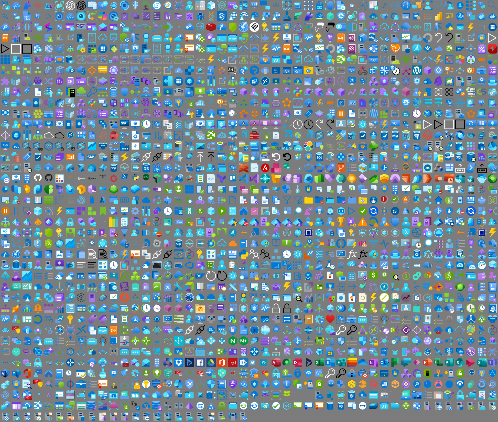

<div align="center">

# 🔷 V I S I O - A Z U R E

### A modern, searchable Visio stencil set for Microsoft Azure

**1,773 masters. Working shape search. Connection points. Shape data. Metric *and* US-unit builds. Drop-in ready.**

<br/>

[](https://github.com/xeeva/Visio-Azure)
[](LICENSE)
[](https://xeeva.github.io/Visio-Azure)
[](https://www.microsoft.com/en-au/microsoft-365/visio)
[](https://github.com/sponsors/xeeva)

<br/>

<table>
<tr>
<td>

```
██╗   ██╗██╗███████╗██╗ ██████╗       █████╗ ███████╗██╗   ██╗██████╗ ███████╗
██║   ██║██║██╔════╝██║██╔═══██╗     ██╔══██╗╚══███╔╝██║   ██║██╔══██╗██╔════╝
██║   ██║██║███████╗██║██║   ██║     ███████║  ███╔╝ ██║   ██║██████╔╝█████╗
╚██╗ ██╔╝██║╚════██║██║██║   ██║     ██╔══██║ ███╔╝  ██║   ██║██╔══██╗██╔══╝
 ╚████╔╝ ██║███████║██║╚██████╔╝     ██║  ██║███████╗╚██████╔╝██║  ██║███████╗
  ╚═══╝  ╚═╝╚══════╝╚═╝ ╚═════╝      ╚═╝  ╚═╝╚══════╝ ╚═════╝ ╚═╝  ╚═╝╚══════╝
```

</td>
</tr>
</table>

---

**Drop. Connect. Document. Done.**

</div>

<br/>

## The Problem

Microsoft maintains a beautiful set of Azure service icons, but they ship as flat SVGs. Dropping them onto a Visio canvas works, but you lose every Visio feature that makes diagramming productive:

- **No connection points** -- lines snap to the icon edge or centre instead of a fixed N/E/S/W/corner anchor.
- **No properly positioned text field** -- captions land in the middle of the icon and have to be repositioned by hand on every drop.
- **Import size depends on the source viewBox** -- one icon comes in at 9 mm, the next at 32 mm, and you spend more time resizing than designing.
- **No shape data** -- you can't programmatically tag a master with the ResourceId / Location / SubscriptionId metadata Azure resources actually carry.
- **Shape search is broken** -- the original stencil sets had keywords in only one of the four cells Visio actually indexes, so typing "vmss" in the Shapes panel found nothing.
- **One unit system only** -- a stencil authored in millimetres drops at the wrong real-world size onto a US-units (inches) drawing, and vice-versa.

These limitations were the difference between *Azure icons in Visio* and *an Azure stencil for Visio*.

## The Solution

**Visio-Azure** is a fully-equipped, programmatically-built Visio stencil set covering **1,773 masters** across 17 groups -- Azure services, configuration items, and on-prem / IaaS workloads -- shipped in both **Metric** and **US-unit** builds. Every master in every stencil ships with:

- ✅ **Nine named connection points** -- North, East, South, West, four corners, plus SouthOfText for caption anchoring
- ✅ **Pre-positioned caption field** -- the text below the icon, not over it, capped to wrap on long names
- ✅ **20 mm normalised size** -- every icon's longer side scales to 20 mm (or the imperial equivalent) so a drawing of 50 different services looks like one drawing, not a collage
- ✅ **Seven Shape Data fields** -- ResourceId, Location, ResourceName, ResourceGroupName, ResourceType, TagsTable, SubscriptionId, populated for every non-Office365 master
- ✅ **Working shape search** -- keywords written into *all four* of the cells Visio indexes, so typing `vmss` or `key vault` actually finds something
- ✅ **27 dark-mode (`-DM`) variants** -- monochrome-black logos (OpenAI, GitHub, Kafka, action glyphs, …) ship a white-fill twin so they stay visible on a dark canvas
- ✅ **A drawing-resources companion stencil** -- DashBox, Line, PathLine, AngleLine, ArcLine, Callout, Bubble, GlowLine, GlowBox (9 colours), single/dashed/thick connector arrows, and colour palettes for annotation

**[Read the full documentation →](https://xeeva.github.io/Visio-Azure)**

<br/>

## Preview

<div align="center">



*Watermarked preview. Per-icon SVG and PNG versions are available to **[GitHub sponsors](#sponsorship)**.*

</div>

<br/>

## ⚠️ Pick your units first: Metric or US

This is the one decision to get right before you download. We ship **two identical icon sets** that differ only in their internal Visio measurement units.

| Your Visio drawing uses… | Download | Folder |
| --- | --- | --- |
| **Centimetres / millimetres** (most of the world, AU/EU/UK metric templates) | **[Metric stencils (.zip)](Visio-Azure-Stencils-Metric-V5.zip)** | [`M/`](M) |
| **Inches / feet** (US templates, US/Imperial regional setting) | **[US stencils (.zip)](Visio-Azure-Stencils-US-V5.zip)** | [`U/`](U) |

**Why two stencils?** A Visio master carries its size in a fixed unit system. Drop a millimetre-authored icon onto an inches drawing and Visio re-interprets the number, so a 20 mm icon can land at the wrong physical size and your shape-data measurements read awkwardly. Matching the stencil's units to your drawing means icons drop at the correct real-world size, snap cleanly to the grid, and report sensible dimensions. **The artwork, connection points, shape data, and search keywords are identical in both** -- only the unit system changes.

> Not sure which you use? In Visio: **Design → Page Setup → Measurement units**. If it says cm/mm, take Metric; if inches/feet, take US. The metric build files end in `_m`, the US build in `_u`.

<br/>

## Quick Start

### 1. Download the set for your units

Grab the zip from the table above, or pick individual stencils:

| Option | Metric | US |
| --- | --- | --- |
| **All icons** (easiest start) | [`M/Azure_All-Icons_V-5_m.vssx`](M/Azure_All-Icons_V-5_m.vssx) | [`U/Azure_All-Icons_V-5_u.vssx`](U/Azure_All-Icons_V-5_u.vssx) |
| **Drawing resources** (lines, arrows, callouts, glows) | [`M/Azure_Drawing-Resources_V-5.vssx`](M/Azure_Drawing-Resources_V-5.vssx) | [`U/Azure_Drawing-Resources_V-5.vssx`](U/Azure_Drawing-Resources_V-5.vssx) |
| **By group** (AI, Networking, Storage, …) | [`M/`](M) | [`U/`](U) |

A grid preview of every icon is in [`Azure_All-Icons-Preview_V-5.vsdx`](Azure_All-Icons-Preview_V-5.vsdx).

### 2. Open in Visio

Double-click any `.vssx`. The stencil opens in Visio's **Shapes** panel on the left.

### 3. Drop and Connect

Drag an icon onto the canvas. Hover near an edge to see the connection points; draw a connector from one icon's anchor straight to another's.

### 4. Search

Type a service name into the search box at the top of the Shapes panel ("key vault", "vmss", "load balancer"). The fix for the legacy broken-search bug is in every master.

### 5. Dark canvas? Use the `-DM` icons

Working on a dark theme or dark-filled background? The 27 black logos each have a `-DM` twin (e.g. search `OpenAI -DM`, `GitHub -DM`) drawn in white so they stay legible.

**[Full setup guide, including how to enable Visio shape search →](https://xeeva.github.io/Visio-Azure/getting-started)**

<br/>

## Icon Features

<table>
<tr>
<td align="center" width="20%">

### 🔗 Connection Points
Nine named anchors per icon for predictable line attach.

**N / E / S / W / corners**

</td>
<td align="center" width="20%">

### 📐 Normalised Size
20 mm on the longer side. Aspect preserved.

**Every icon the same scale**

</td>
<td align="center" width="20%">

### 🏷️ Shape Data
Seven fields ready for resource metadata.

**ResourceId, Location, …**

</td>
<td align="center" width="20%">

### 🔍 Search Works
Keywords in all four cells Visio actually indexes.

**Type "vmss" -- find Scale Set**

</td>
<td align="center" width="20%">

### 🌓 Dark Mode
White `-DM` twins for black logos.

**Visible on any canvas**

</td>
</tr>
</table>

**[How each of these works, in depth →](https://xeeva.github.io/Visio-Azure/icon-features)**

<br/>

## Sponsorship

The `.vssx` stencils are **free and GPL-licensed**. You can download every one of the 1,773 masters from this repo right now.

The accompanying **per-icon SVG and PNG files**, however, are sponsor-only. The previous Azure-Design repo distributed SVG and PNG freely, and they were systematically re-hosted by other parties with attribution stripped. Moving the raw asset files behind a sponsor tier is how we keep the stencil collection maintained without watching the work disappear.

**What sponsors get:**

- 🎨 Per-icon SVG files (normalised, cleaned, drop-ready)
- 🖼️ High-resolution PNG renders (256 px and 1024 px sets)
- 🚀 Early access to new releases
- 📚 The non-watermarked preview image
- 💬 Sponsor-only Discussions for feature requests / new-icon proposals
- ⭐ Your name in the project README (optional)

**Tiers:**

| Tier | What you get |
| --- | --- |
| **Supporter** -- $3/mo | All sponsor benefits above, ongoing access while sponsorship is active |
| **Studio** -- $15/mo | Supporter + commercial-use clearance for teams of up to 25 |
| **Enterprise** -- $50/mo | Studio + priority on icon-request triage and named credit in releases |

**[Sponsor on GitHub →](https://github.com/sponsors/xeeva)**

<br/>

## Versioning

Stencils are versioned by Microsoft icon-pack revision plus our own patch level.

| Version | Released | Masters | Notable |
| --- | --- | --- | --- |
| **V-5** | 2026-06 | 1,773 | Metric + US-unit builds. 27 dark-mode `-DM` variants. Consolidated API Management naming. Rescaled custom Workload icons. Working shape search. Drawing-resources companion. |
| V-4.7 (legacy) | 2024-09 | 1,233 | Final PowerShell + Visio-COM build of the original Azure-Design stencil set. Archived; superseded by this project. |

The newest release is also published as a [GitHub Release](https://github.com/xeeva/Visio-Azure/releases) with per-unit zip downloads.

**[Full release notes →](https://xeeva.github.io/Visio-Azure/releases)**

<br/>

## Origin and Acknowledgements

This project is a ground-up rewrite of the original Azure-Design stencil pipeline: cross-platform Python in place of PowerShell + Visio COM, OOXML emitted directly so no Visio install is required at build time, and a comprehensive fix for the long-standing broken-search bug. The original stencil set has been archived in favour of this project.

The source icons are Microsoft Azure service icons, distributed under the terms Microsoft publishes alongside them.

This work is licensed under **GPL-3.0** -- you may redistribute, modify, and use the stencils freely, including in commercial work, provided you preserve the licence and attribution.

<br/>

## Get Involved

- **Request an icon:** [open an Icon Request](https://github.com/xeeva/Visio-Azure/issues/new?template=icon_request.yml) -- missing a service? Ask for it.
- **Report a problem:** [open a Bug Report](https://github.com/xeeva/Visio-Azure/issues/new?template=bug_report.yml) -- a wrong-looking icon, rendering glitch, or search miss.
- **Discussions:** [github.com/xeeva/Visio-Azure/discussions](https://github.com/xeeva/Visio-Azure/discussions) -- ask questions, show off diagrams, propose ideas.
- **Sponsor:** [github.com/sponsors/xeeva](https://github.com/sponsors/xeeva) -- support ongoing maintenance and get the SVG/PNG asset library.

<div align="center">

<br/>

*Made for designers, architects, and anyone who still believes a good diagram beats a thousand words.*

</div>
