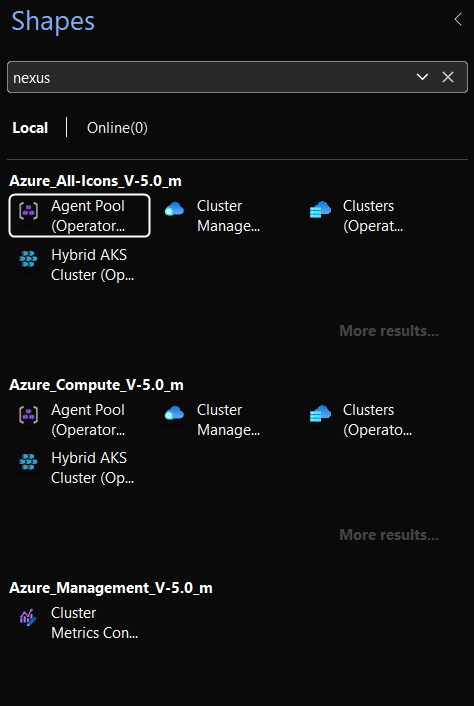

# Getting Started

A step-by-step walk-through from download to first diagram.

## Requirements

- **Microsoft Visio** -- Plan 1, Plan 2, or any of the Visio 2019 / 2021 / 2024 desktop editions. Visio for the Web is **not** supported (it cannot render custom .vssx stencils).
- **Windows** or **macOS** -- the stencil is OOXML so it loads cleanly on either.
- ~3 MB of disk space for the full set.

## 1. Download

Three options depending on how much of the collection you need.

### Just the all-icons stencil

The simplest place to start. One file, every Azure service, every drawing-resource shape.

[`Azure_All-Icons_V-5.0.vssx`](https://github.com/xeeva/Visio-Azure/raw/main/stencils/V-5.0/Azure_All-Icons_V-5.0.vssx) (≈ 3 MB)

### The full set

A ZIP of every stencil including the per-group stencils.

[`V-5.0.zip`](https://github.com/xeeva/Visio-Azure/releases) -- from the **Releases** page.

### A specific category

If you only design for one part of Azure, grab just that group.

| Group | File |
| --- | --- |
| AI | [`Azure_AI_V-5.0.vssx`](https://github.com/xeeva/Visio-Azure/raw/main/stencils/V-5.0/Azure_AI_V-5.0.vssx) |
| Application | [`Azure_Application_V-5.0.vssx`](https://github.com/xeeva/Visio-Azure/raw/main/stencils/V-5.0/Azure_Application_V-5.0.vssx) |
| Compute | [`Azure_Compute_V-5.0.vssx`](https://github.com/xeeva/Visio-Azure/raw/main/stencils/V-5.0/Azure_Compute_V-5.0.vssx) |
| Data | [`Azure_Data_V-5.0.vssx`](https://github.com/xeeva/Visio-Azure/raw/main/stencils/V-5.0/Azure_Data_V-5.0.vssx) |
| Deployment | [`Azure_Deployment_V-5.0.vssx`](https://github.com/xeeva/Visio-Azure/raw/main/stencils/V-5.0/Azure_Deployment_V-5.0.vssx) |
| Identity | [`Azure_Identity_V-5.0.vssx`](https://github.com/xeeva/Visio-Azure/raw/main/stencils/V-5.0/Azure_Identity_V-5.0.vssx) |
| IoT | [`Azure_IoT_V-5.0.vssx`](https://github.com/xeeva/Visio-Azure/raw/main/stencils/V-5.0/Azure_IoT_V-5.0.vssx) |
| Management | [`Azure_Management_V-5.0.vssx`](https://github.com/xeeva/Visio-Azure/raw/main/stencils/V-5.0/Azure_Management_V-5.0.vssx) |
| Networking | [`Azure_Networking_V-5.0.vssx`](https://github.com/xeeva/Visio-Azure/raw/main/stencils/V-5.0/Azure_Networking_V-5.0.vssx) |
| Security | [`Azure_Security_V-5.0.vssx`](https://github.com/xeeva/Visio-Azure/raw/main/stencils/V-5.0/Azure_Security_V-5.0.vssx) |
| Storage | [`Azure_Storage_V-5.0.vssx`](https://github.com/xeeva/Visio-Azure/raw/main/stencils/V-5.0/Azure_Storage_V-5.0.vssx) |
| Workload | [`Azure_Workload_V-5.0.vssx`](https://github.com/xeeva/Visio-Azure/raw/main/stencils/V-5.0/Azure_Workload_V-5.0.vssx) |

See the [stencils/V-5.0](https://github.com/xeeva/Visio-Azure/tree/main/stencils/V-5.0) folder for the complete list of 18 per-group stencils, plus the drawing-resources companion.

## 2. Install

Two options. The first is faster; the second persists across drawings.

### Open on demand

Double-click any `.vssx`. Visio opens it in the **Shapes** panel on the left for the current drawing only.

### Add to your My Shapes folder

Drop the `.vssx` into your Visio **My Shapes** directory:

**Windows:** `%USERPROFILE%\Documents\My Shapes`

**macOS:** `~/Library/Group Containers/UBF8T346G9.Office/User Content/My Shapes`

Restart Visio. The stencil now appears under **More Shapes → My Shapes**, available in every drawing.

## 3. Drop your first icon

1. In Visio, open your drawing (or **File → New → Blank Drawing**).
2. Open the Visio-Azure stencil if it isn't already in your **Shapes** panel.
3. Drag any icon onto the canvas.
4. Hover near an edge of the icon -- one of the nine connection points (the small blue ×) becomes active.
5. Draw a connector from that anchor to another icon's anchor. The connector glues to the exact point, not the icon's bounding box.

## 4. Search for services

Type any service name into the search box at the top of the Shapes panel. Try `vmss`, `key vault`, `cosmos db`, `front door`. Many other community stencils have a long-standing search gap here -- the [Enabling search](enabling-search) page covers why, what Visio-Azure fixes, and what to do if your Visio's shape search needs to be turned on first.

## Next steps

- **[Icon features](icon-features)** -- the full list of what each master ships with
- **[Drawing resources](drawing-resources)** -- the companion stencil with annotation shapes
- **[Sponsorship](sponsorship)** -- how to get the SVG and PNG asset files
