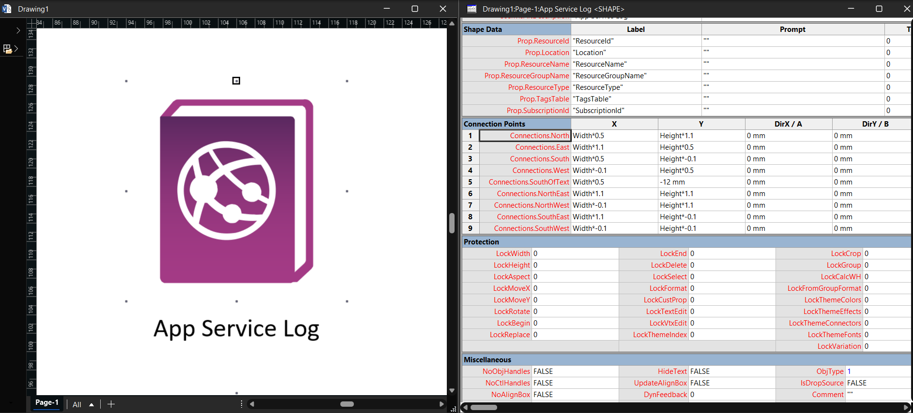
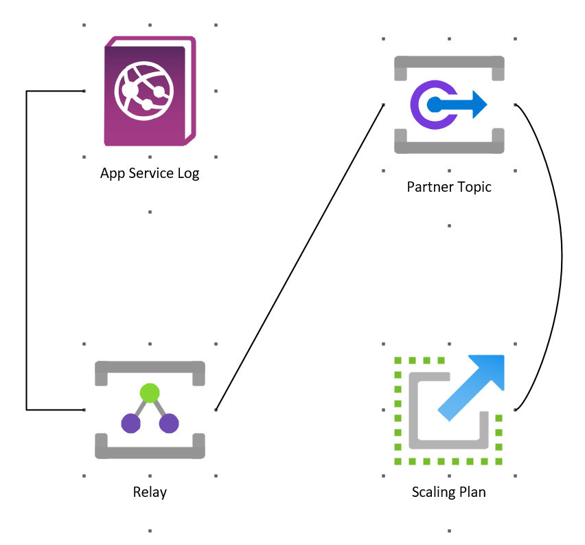
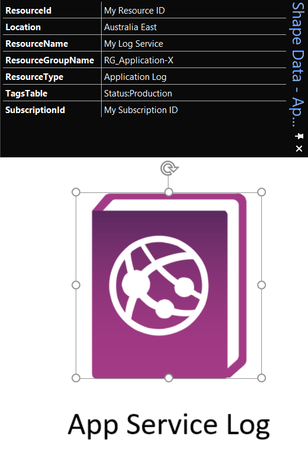
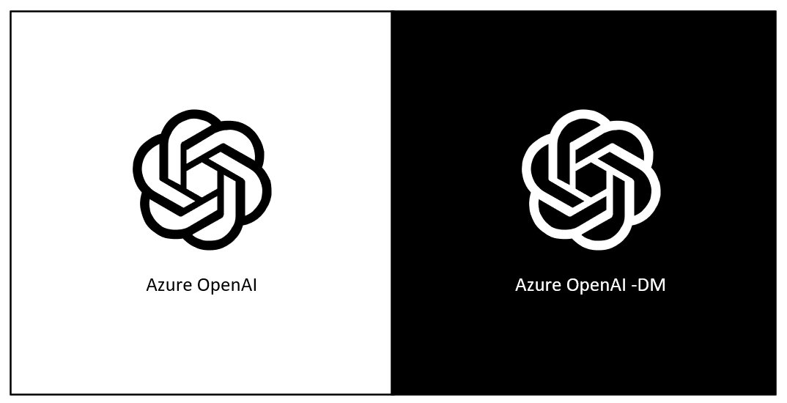

# Icon Features

What every Visio-Azure master carries, why, and how to use it.

## Nine connection points

Every master has nine named connection points, positioned mathematically relative to the icon's centre so any of the four cardinal directions, four diagonals, or "below the caption" anchors snap precisely:

| Name | Formula | Use |
| --- | --- | --- |
| `North` | (Width × 0.5, Height × 1.1) | Lines coming **down to** the icon from above |
| `East` | (Width × 1.1, Height × 0.5) | Right-side connectors |
| `South` | (Width × 0.5, Height × -0.1) | Lines coming **up to** the icon from below |
| `West` | (Width × -0.1, Height × 0.5) | Left-side connectors |
| `NorthEast` | (Width × 1.1, Height × 1.1) | 45° anchors |
| `NorthWest` | (Width × -0.1, Height × 1.1) | |
| `SouthEast` | (Width × 1.1, Height × -0.1) | |
| `SouthWest` | (Width × -0.1, Height × -0.1) | |
| `SouthOfText` | (Width × 0.5, -12 mm) | Anchor **below** the caption -- chain of icons in a vertical list |

The anchors sit 10% outside the icon's bbox so a glued connector ends just outside the icon's edge -- which renders cleanly without overlap.

## Twenty-millimetre normalised size

Each icon is fit to **20 mm on its longer side**, aspect preserved. This means:

- An 18 × 18 icon renders at 20 × 20 mm.
- A 18 × 14 icon renders at 20 × 15.5 mm.
- A 14 × 18 icon renders at 15.5 × 20 mm.

A drawing of fifty different Azure services therefore looks like one drawing, not a collage of icons at random sizes. Sizing is taken from the icon's **viewBox longer side**, so an icon only fills the frame when its artwork fills its viewBox. Microsoft's Azure icons are authored that way (artwork ≈ 85% of the viewBox). The handful of custom on-prem / IaaS **Workload** icons originally carried a much larger viewBox than their artwork, so they came in at roughly a third the size of everything else; in V-5 their viewBoxes were tightened to ~85% fill so they now match the Azure icons exactly.

This build is produced in two unit systems -- see [Metric vs US units](units). The 20 mm figure applies to the metric (`_m`) build; the US (`_u`) build uses the imperial equivalent.

## Seven Shape Data fields

Every non-Office365 master ships with these fields ready for resource metadata:

| Field | Type | Notes |
| --- | --- | --- |
| `ResourceId` | String | The full ARM resource ID |
| `Location` | String | Azure region |
| `ResourceName` | String | The service instance name |
| `ResourceGroupName` | String | Containing resource group |
| `ResourceType` | String | E.g. `Microsoft.Storage/storageAccounts` |
| `TagsTable` | String | Tags JSON or CSV |
| `SubscriptionId` | String | GUID |

PowerShell or VBA scripts can iterate the masters on a page and populate these from an Azure inventory, enabling round-trip Visio → ARM / ARM → Visio workflows.

The Office365 group is excluded because those icons represent SaaS applications and don't carry ARM-style identifiers.

## Caption placement

Each master's caption text sits **below** the icon, not over it. Sizes:

- `TxtPinX` = Width × 0.5 (centred)
- `TxtPinY` = Height × -0.25 (just below the icon)
- `TxtWidth` = capped at 35 mm so long names wrap to two lines instead of bleeding sideways
- `TxtHeight` = TEXTHEIGHT(TheText, TxtWidth) (grows for wrapped text)
- `Char.Font` = 4, `Char.Size` = 8 pt, `Char.Color` = RGB(0,0,0)

## Searchable from the panel

Keywords are written into every cell Visio indexes -- `Prompt`, `Description`, the `ShapeKeywords` PageSheet cell, document-level `Keywords` in app.xml, and `dc:subject` in core.xml. Type any service or part-name into the Shapes panel search box and the masters surface immediately.

For details on why this used to be broken and how to enable Visio's own search, see [Enabling Search](enabling-search).

## Dark-mode (`-DM`) variants

A handful of Azure and third-party logos are drawn as solid black on a transparent background (Azure OpenAI, GitHub, Kafka, the App Service / Virtual Machine / SQL action glyphs, Resource Lock, BitLocker Key, and more). On a light canvas they're fine; on a dark theme or a dark-filled shape they vanish.

V-5 detects every all-black icon across the corpus and ships a **white-fill twin** named with a `-DM` suffix (for example, search `OpenAI -DM` or `GitHub -DM`). The twin has every fill recoloured white -- including the caption text -- so it reads cleanly on a dark canvas while the original stays ideal for light backgrounds. There are **27** such variants.

The recolour is real fill geometry, not an outline or effect, so the `-DM` icons scale exactly like any other master -- no haloing or blobbing at small sizes. Use the original on light backgrounds and the `-DM` twin on dark ones.

## ResizeMode = 2

`Master.ResizeMode = 2` means when you scale a master after dropping, the line weight and font size scale with it. Useful when you've got a high-level system overview at one scale and a detailed component sub-diagram at another -- the icons retain their proportions either way.

## Double-click opens the text editor

`EventDblClick = OPENTEXTWIN()` -- double-clicking any icon jumps straight into editing its caption, which is by far the most frequent post-drop edit.

## Behaviour

- `Language = 1033` (en-US, the canonical Visio language ID)
- `Char.LangID = 1033` (consistent caption language)
- AlternativeText set to the display name -- screen reader / accessibility tooling works correctly

## Per-master contract

The exact configuration applied to every master is pinned in code at `src/visio_azure/ooxml/geometry.py` in the build pipeline. Every cell value comes from a named constant; nothing is inlined. Changes there are deliberate departures from legacy behaviour and are documented in [Release Notes](releases).
